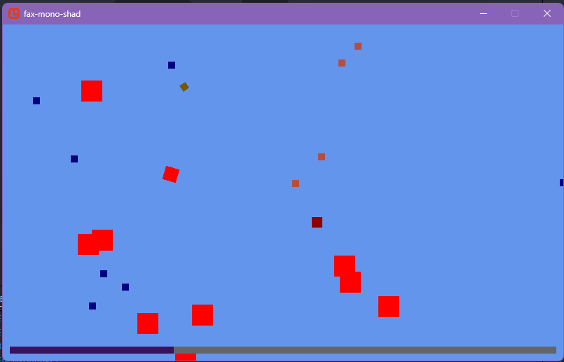

# Fax Mono Shad

Fax Mono Shad is a 2D game built with MonoGame and C#. The project features a player, enemies, bullets, pickups, experience points, and various managers for handling game logic and rendering. The codebase is organized into entities, events, managers, renderers, spawners, and utility classes for maintainability and scalability.

## Features
- Player movement and shooting
- Enemy spawning and collision detection
- Bullet and weapon mechanics
- Experience and score system
- Audio and texture management
- Event-driven architecture

## Getting Started
1. Clone the repository.
2. Open `fax-mono-shad.sln` in Visual Studio or your preferred IDE.
3. Build and run the project.

## Requirements
- .NET 8.0
- MonoGame Framework

## Folder Structure
- `Entities/` - Game objects like Player, Enemy, Bullet, etc.
- `Managers/` - Handles audio, textures, enemies, pickups, and experience.
- `Renderers/` - Responsible for drawing game objects.
- `Events/` - Event classes for game logic.
- `Spawners/` - Spawning logic for bullets and pickups.
- `Utils/` - Utility and extension methods.
- `Content/` - Game assets and content pipeline.

